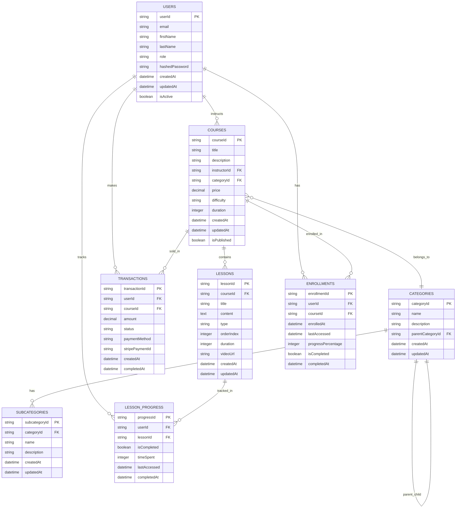

# Learning Management System (LMS)

## Overview

A comprehensive Learning Management System built with modern web technologies, featuring user management, course creation, content delivery, and assessment capabilities.

## 🏗️ System Architecture

### Infrastructure Overview

```
Frontend (Vercel) ↔ API Gateway ↔ Lambda Functions ↔ DynamoDB
                                            ↓
                                        S3 Storage
```

The system follows a modern serverless architecture pattern:

1. **Client Applications** (React/Next.js) hosted on Vercel
2. **API Gateway** manages all API requests and routing
3. **Lambda Functions** handle business logic and data processing
4. **DynamoDB** stores all application data with single-table design
5. **S3** manages file storage for course materials, videos, and assets
6. **ECR** stores containerized Lambda functions for complex operations

### CI/CD Pipeline

```
Developer Push → GitHub → GitHub Actions → Build & Test → Deploy to Vercel (Frontend)
                                      ↓
                                   AWS Lambda (Backend)
```

**Automated Deployment Flow:**
1. Code push to GitHub triggers GitHub Actions
2. Automated testing and quality checks
3. Frontend automatically deploys to Vercel
4. Backend services deploy to AWS Lambda
5. Database migrations run automatically
6. Health checks verify deployment success

### Core Database Entities

- **USERS**: Central user management with role-based access control
- **COURSES**: Course catalog and management
- **LESSONS**: Individual learning units within courses
- **TRANSACTIONS**: Payment and billing management
- **CATEGORIES**: Course and content categorization

### Entity Relationship Diagram (ERD)

The following ERD illustrates the logical structure and relationships between entities:



### Single-Table Design Implementation (DynamoDB)

While the ERD shows the logical relationships, the actual DynamoDB implementation uses a single-table design:

```
PK                    | SK                    | GSI1PK              | GSI1SK              | Data
---------------------|----------------------|--------------------|--------------------|------------------
USER#123             | PROFILE              | EMAIL#user@example  | USER#123           | User profile
USER#123             | ENROLLMENT#COURSE456 | COURSE#456          | USER#123           | Enrollment details
COURSE#456           | METADATA             | CATEGORY#TECH       | COURSE#456         | Course information
COURSE#456           | LESSON#789           | LESSON#789          | COURSE#456         | Lesson content
TRANSACTION#101      | PAYMENT              | USER#123            | TRANSACTION#101    | Payment details
CATEGORY#TECH        | METADATA             | -                   | -                  | Category info
LESSON#789           | PROGRESS#USER123     | USER#123            | LESSON#789         | Progress tracking
```

**Access Patterns Supported:**
1. Get user profile: `PK = USER#123, SK = PROFILE`
2. Get user enrollments: `PK = USER#123, SK begins_with ENROLLMENT#`
3. Get course lessons: `PK = COURSE#456, SK begins_with LESSON#`
4. Get courses by category: `GSI1PK = CATEGORY#TECH, GSI1SK begins_with COURSE#`
5. Get user transactions: `GSI1PK = USER#123, GSI1SK begins_with TRANSACTION#`

**Benefits of Single-Table Design:**
- Consistent performance regardless of data size
- Reduced costs compared to multiple tables
- Atomic transactions across related entities
- Optimized for access patterns rather than normalization
- Single network call for related data retrieval

### Key Features

- **User Management**: Secure authentication with role-based permissions
- **Course Management**: Create, organize, and manage educational content
- **Lesson System**: Structured learning paths with multimedia content
- **Payment Integration**: Transaction handling for course purchases
- **Analytics**: Comprehensive tracking and reporting capabilities

## 🚀 Technology Stack

### Backend & Infrastructure
- **Database**: Amazon DynamoDB - NoSQL database for scalable data storage
- **Compute**: AWS Lambda - Serverless compute for API endpoints
- **Storage**: Amazon S3 - Object storage for course materials and media
- **Registry**: Elastic Container Registry (ECR) - Container image management
- **API Gateway**: AWS API Gateway - RESTful API management and routing

### Frontend & Deployment
- **Frontend Hosting**: Vercel - Fast, global CDN with automatic deployments
- **Version Control**: GitHub - Source code management and collaboration
- **CI/CD**: GitHub Actions + Vercel - Automated testing and deployment pipeline

### Why This Architecture?

**DynamoDB Benefits:**
- **Scalability**: Automatically scales to handle varying workloads
- **Performance**: Single-digit millisecond latency for consistent performance
- **Flexibility**: Schema-less design allows for rapid iteration
- **Cost-Effective**: Pay-per-use model with no upfront costs
- **Managed Service**: Fully managed with built-in security and backups

**Serverless Advantages:**
- **Zero Server Management**: Focus on code, not infrastructure
- **Automatic Scaling**: Scales from zero to enterprise-level instantly
- **Pay-per-Request**: Only pay for actual usage
- **High Availability**: Built-in redundancy and fault tolerance

## 📊 Entity Relationship Overview

### Primary Relationships

1. **USERS ↔ COURSES**: Many-to-many relationship through enrollments
2. **COURSES ↔ LESSONS**: One-to-many relationship for course content
3. **USERS ↔ TRANSACTIONS**: One-to-many for payment history
4. **COURSES ↔ CATEGORIES**: Many-to-one for course organization
5. **LESSONS ↔ SUBCATEGORIES**: Hierarchical content organization

### Key Attributes

**USERS**
- User identification and authentication
- Profile management
- Role-based access control
- Session management

**COURSES**
- Course metadata and descriptions
- Pricing and availability
- Instructor assignments
- Category associations

**LESSONS**
- Content delivery
- Progress tracking
- Resource management
- Interactive elements

**TRANSACTIONS**
- Payment processing
- Billing history
- Revenue tracking
- Subscription management

## 🔧 Installation & Setup

### Prerequisites

- Node.js (v18 or higher)
- AWS Account with appropriate permissions
- GitHub account for version control
- Vercel account for frontend deployment

### Environment Variables

Create environment files for different stages:

**.env.local** (Local Development)
```env
# AWS Configuration
AWS_REGION=us-east-1
AWS_ACCESS_KEY_ID=your-access-key
AWS_SECRET_ACCESS_KEY=your-secret-key

# DynamoDB
DYNAMODB_TABLE_NAME=lms-dev-table
DYNAMODB_ENDPOINT=http://localhost:8000  # For local DynamoDB

# API Gateway
API_GATEWAY_URL=https://your-api-id.execute-api.region.amazonaws.com/dev

# Authentication
JWT_SECRET=your-jwt-secret-key
NEXTAUTH_SECRET=your-nextauth-secret
NEXTAUTH_URL=http://localhost:3000

# S3 Storage
S3_BUCKET_NAME=lms-course-materials-dev
S3_REGION=us-east-1

# External Services
STRIPE_SECRET_KEY=sk_test_...
STRIPE_WEBHOOK_SECRET=whsec_...
```

**.env.production** (Production)
```env
# AWS Configuration (Use IAM roles in production)
AWS_REGION=us-east-1

# DynamoDB
DYNAMODB_TABLE_NAME=lms-prod-table

# API Gateway
API_GATEWAY_URL=https://api.yourdomain.com

# Authentication
JWT_SECRET=your-production-jwt-secret
NEXTAUTH_SECRET=your-production-nextauth-secret
NEXTAUTH_URL=https://yourdomain.com

# S3 Storage
S3_BUCKET_NAME=lms-course-materials-prod
S3_REGION=us-east-1

# External Services
STRIPE_SECRET_KEY=sk_live_...
STRIPE_WEBHOOK_SECRET=whsec_...
```

### Local Development Setup

```bash
# Clone the repository
git clone https://github.com/yourusername/learning-management-system.git
cd learning-management-system

# Install dependencies for both frontend and backend
npm install

# Install backend dependencies
cd backend
npm install

# Install frontend dependencies
cd ../frontend
npm install

# Return to root directory
cd ..

# Set up local DynamoDB (optional)
npm run dynamodb:local

# Initialize database tables
npm run db:init

# Start the development servers
npm run dev  # Starts both frontend and backend
```

### AWS Infrastructure Setup

#### 1. DynamoDB Setup
```bash
# Create DynamoDB table
aws dynamodb create-table \
  --table-name lms-production \
  --attribute-definitions \
    AttributeName=PK,AttributeType=S \
    AttributeName=SK,AttributeType=S \
  --key-schema \
    AttributeName=PK,KeyType=HASH \
    AttributeName=SK,KeyType=RANGE \
  --billing-mode PAY_PER_REQUEST
```

#### 2. Lambda Functions Deployment
```bash
# Deploy all Lambda functions
npm run deploy:lambda

# Deploy specific function
npm run deploy:lambda -- --function user-management
```

#### 3. S3 Bucket Setup
```bash
# Create S3 bucket for course materials
aws s3 mb s3://lms-course-materials-prod

# Set up bucket policy for secure access
aws s3api put-bucket-policy \
  --bucket lms-course-materials-prod \
  --policy file://s3-bucket-policy.json
```

### Deployment

#### Frontend Deployment (Vercel)

1. **Connect GitHub Repository**
   - Link your repository to Vercel
   - Configure build settings:
     - Build Command: `npm run build`
     - Output Directory: `.next`
     - Install Command: `npm install`

2. **Environment Variables**
   - Add all production environment variables in Vercel dashboard
   - Enable automatic deployments on main branch

3. **Custom Domain** (Optional)
   ```bash
   # Add custom domain in Vercel dashboard
   # Update DNS records as instructed
   ```

#### Backend Deployment (AWS)

```bash
# Deploy using Serverless Framework
npm run deploy:prod

# Or using AWS SAM
sam build
sam deploy --guided
```

#### Database Migration

```bash
# Run database migrations
npm run db:migrate

# Seed initial data
npm run db:seed
```

## 🔑 API Endpoints

### Authentication
- `POST /auth/login` - User login
- `POST /auth/register` - User registration
- `POST /auth/logout` - User logout
- `GET /auth/profile` - Get user profile

### Courses
- `GET /courses` - List all courses
- `POST /courses` - Create new course
- `GET /courses/:id` - Get course details
- `PUT /courses/:id` - Update course
- `DELETE /courses/:id` - Delete course

### Lessons
- `GET /lessons/:courseId` - Get lessons for a course
- `POST /lessons` - Create new lesson
- `PUT /lessons/:id` - Update lesson
- `DELETE /lessons/:id` - Delete lesson

### Transactions
- `POST /transactions` - Process payment
- `GET /transactions/:userId` - Get user transaction history
- `GET /transactions` - Admin: Get all transactions

## 📈 Features

### For Students
- Course browsing and enrollment
- Interactive lessons and content
- Progress tracking
- Certificate generation
- Discussion forums

### For Instructors
- Course creation and management
- Student progress monitoring
- Content upload and organization
- Analytics dashboard

### For Administrators
- User management
- System analytics
- Payment processing
- Content moderation

## 🔄 Data Flow

1. **User Registration/Login**: Authentication and session management
2. **Course Discovery**: Browse available courses by category
3. **Enrollment**: Payment processing and course access
4. **Learning**: Progress through lessons with tracking
5. **Assessment**: Quizzes and assignments
6. **Completion**: Certificates and achievements

## 🛡️ Security

- JWT-based authentication
- Role-based access control (RBAC)
- Input validation and sanitization
- SQL injection prevention
- CORS configuration
- Rate limiting

## 📊 Monitoring & Analytics

- User engagement metrics
- Course completion rates
- Revenue tracking
- Performance monitoring
- Error logging and alerting

## 🚀 Deployment Options

### Production Deployment

The application is designed for cloud-native deployment with the following setup:

#### Current Architecture
- **Frontend**: Deployed on Vercel with automatic GitHub integration
- **Backend**: AWS Lambda functions behind API Gateway
- **Database**: Amazon DynamoDB with single-table design
- **Storage**: Amazon S3 for static assets and course materials
- **CI/CD**: GitHub Actions for backend, Vercel for frontend

#### Alternative Deployment Options

**1. Full AWS Deployment**
```bash
# Deploy using AWS CDK
npm run cdk:deploy

# Or using Serverless Framework
serverless deploy --stage production
```

**2. Container-based Deployment**
```bash
# Build Docker images
docker build -t lms-frontend ./frontend
docker build -t lms-backend ./backend

# Deploy to AWS ECS/Fargate
aws ecs create-service --cli-input-json file://ecs-service.json

# Or deploy to Kubernetes
kubectl apply -f k8s-manifests/
```

**3. Hybrid Deployment**
- Frontend: Vercel (current)
- Backend: AWS ECS or EKS
- Database: Amazon RDS (if switching from DynamoDB)

### Monitoring & Observability

#### AWS CloudWatch Integration
```javascript
// Lambda function with CloudWatch logging
const AWS = require('aws-sdk');
const cloudwatch = new AWS.CloudWatch();

// Custom metrics
await cloudwatch.putMetricData({
  Namespace: 'LMS/API',
  MetricData: [{
    MetricName: 'CourseEnrollments',
    Value: 1,
    Unit: 'Count'
  }]
}).promise();
```

#### Vercel Analytics
- Real User Monitoring (RUM)
- Core Web Vitals tracking
- Function performance metrics

## 🧪 Testing

### Test Structure

```
tests/
├── unit/           # Unit tests for individual functions
├── integration/    # API endpoint tests
├── e2e/           # End-to-end user journey tests
└── load/          # Performance and load tests
```

### Running Tests

```bash
# Run all tests
npm run test

# Run specific test suites
npm run test:unit          # Unit tests
npm run test:integration   # Integration tests
npm run test:e2e          # End-to-end tests
npm run test:load         # Load tests

# Generate test coverage
npm run test:coverage

# Watch mode for development
npm run test:watch
```

### CI/CD Testing Pipeline

**GitHub Actions Workflow:**
```yaml
name: CI/CD Pipeline
on: [push, pull_request]

jobs:
  test:
    runs-on: ubuntu-latest
    steps:
      - uses: actions/checkout@v2
      - uses: actions/setup-node@v2
      - run: npm install
      - run: npm run test:unit
      - run: npm run test:integration
      - run: npm run build
      
  deploy:
    needs: test
    runs-on: ubuntu-latest
    if: github.ref == 'refs/heads/main'
    steps:
      - run: npm run deploy:lambda
```

### Testing Tools

- **Unit Tests**: Jest + Testing Library
- **Integration Tests**: Supertest + Jest
- **E2E Tests**: Playwright/Cypress
- **Load Tests**: Artillery.js
- **Mocking**: AWS SDK Mock for DynamoDB testing

## 📝 Contributing

1. Fork the repository
2. Create a feature branch (`git checkout -b feature/amazing-feature`)
3. Commit your changes (`git commit -m 'Add some amazing feature'`)
4. Push to the branch (`git push origin feature/amazing-feature`)
5. Open a Pull Request

### Code Style

- ESLint configuration included
- Prettier for code formatting
- Follow conventional commit messages

## 📄 License

This project is licensed under the MIT License - see the [LICENSE.md](LICENSE.md) file for details.

## 🤝 Support

- Documentation: [docs.yourapp.com](https://docs.yourapp.com)
- Issues: [GitHub Issues](https://github.com/yourusername/lms/issues)
- Email: support@yourapp.com
- Discord: [Join our community](https://discord.gg/yourinvite)

## 🎯 Roadmap

### Current Version (v1.0)
- ✅ User authentication and management
- ✅ Course and lesson management
- ✅ Payment processing
- ✅ Basic analytics

### Upcoming Features (v1.1)
- 🔄 Live streaming integration
- 🔄 Advanced analytics dashboard
- 🔄 Mobile app support
- 🔄 AI-powered recommendations

### Future Enhancements (v2.0)
- 📋 Gamification features
- 📋 Virtual classroom integration
- 📋 Advanced assessment tools
- 📋 Multi-language support

## 💡 Architecture Benefits

### Serverless + Vercel Benefits

**Performance:**
- Global CDN distribution via Vercel
- Edge computing for faster response times
- Automatic scaling based on demand
- Cold start optimization for Lambda functions

**Developer Experience:**
- Instant deployments with Git integration
- Preview deployments for each pull request
- Zero-downtime deployments
- Automatic rollback capabilities

**Cost Efficiency:**
- Pay-per-request pricing model
- No idle server costs
- Automatic resource optimization
- Efficient resource utilization

**Reliability:**
- Multi-region redundancy
- Automatic failover mechanisms
- Built-in monitoring and alerting
- 99.99% uptime SLA

### DynamoDB vs Traditional SQL

**When DynamoDB Excels:**
- High-traffic applications with predictable access patterns
- Applications requiring consistent millisecond latency
- Microservices architecture with service-specific data models
- Applications with varying and unpredictable load patterns

**Trade-offs Considered:**
- Complex queries require careful access pattern design
- No native joins (handled at application level)
- Eventual consistency model (with strong consistency options)
- Learning curve for developers from SQL background

**Migration Strategy:**
If moving from SQL to DynamoDB, consider:
1. Identify access patterns first
2. Design single-table schema around access patterns
3. Implement data access layer abstraction
4. Gradual migration with dual-write strategy

---

## 📈 Getting Started

1. **Set up your environment** following the installation guide
2. **Review the API documentation** to understand available endpoints
3. **Explore the database schema** to understand data relationships
4. **Run the test suite** to ensure everything is working
5. **Start building your features** using the established patterns
